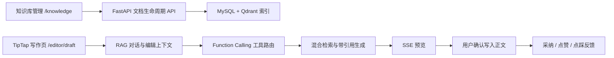

# LiveDoc

LiveDoc 是面向个人知识管理、团队资料沉淀与文档创作的智能写作工作台。前端以 TipTap/ProseMirror 为编辑内核，连接独立的 FastAPI RAG 服务，形成“资料管理 → 权限检索 → 带引用生成 → 人工确认写回 → 反馈采集”的完整产品闭环。

> 本仓库是 LiveDoc 前端。RAG、文档索引和 AI 写作服务位于 [`livedoc_server`](https://github.com/seren-spark/livedoc_server)。

## 核心能力

### 知识库工作区

- 按 `private / team / public` 管理个人、团队和公开资料。
- 支持文档创建、编辑、删除、重新索引和索引状态查看。
- 展示 `pending / indexing / ready / failed` 生命周期、分块数量与失败原因。
- 支持按空间、目录、文档范围筛选检索来源。

入口：`/knowledge`

### TipTap 写作工作台

- 基于 TipTap 3 与 ProseMirror 构建富文本编辑器。
- 在编辑器内打开 RAG 对话面板，传递标题、标签、光标前后文、选区和当前文档。
- 支持公开资料、个人资料、团队资料和当前文档四种检索域。
- 引用可展开查看原始片段；当前文档引用可定位回对应段落。
- AI 输出默认进入预览态，用户确认后才写入正文。

入口：`/editor/draft`

### 受约束的 AI 工具编排

统一输入框通过后端 Function Calling 在以下工具间路由：

- 知识库检索与问答
- 当前文档摘要
- 上下文续写
- 选区格式与表达优化

前端按 `tool_call → tool_result → meta → delta → done` 顺序消费 SSE 事件，先展示工具和资料来源，再增量渲染答案。工具输出不会绕过用户直接修改文档。

### 引用、反馈与可观测性

- 展示文档、分块、版本、可见范围和 dense/keyword/rerank 分数。
- 支持插入正文、点赞和点踩反馈。
- 通过 `trace_id` 关联检索过程、生成结果与采纳行为。
- 知识库页展示检索量、无证据率、P50/P95 延迟和采纳率等运行指标。

### 类 Copilot 内联补全

- 使用 ProseMirror Plugin 与 DecorationSet 渲染不进入文档状态的预测文本。
- 代码块补全由 `CodeBlockWithSuggestion` 扩展承载。
- 用户确认后才把建议写入正文，避免临时预测污染协同编辑状态。

## 产品链路



## 技术栈

| 领域       | 技术                                                  |
| ---------- | ----------------------------------------------------- |
| 基础框架   | React 18、TypeScript、Vite 7                          |
| 编辑器     | TipTap 3、ProseMirror、Extension/Plugin 扩展体系      |
| UI 与样式  | Ant Design 5、UnoCSS、Sass、styled-components         |
| 状态与请求 | Redux Toolkit、Redux Persist、TanStack Query、Axios   |
| 协同编辑   | Yjs、y-websocket、y-indexeddb                         |
| 内容渲染   | React Markdown、marked、KaTeX、highlight.js、lowlight |
| 工程化     | ESLint、Prettier、Husky、TypeScript project build     |

## 快速开始

### 环境要求

- Node.js 20.19+（或 22.12+）
- npm 10+
- 已启动的 LiveDoc 后端，默认地址 `http://127.0.0.1:8000`

### 安装与启动

```powershell
cd E:\LiveDoc\livedoc
npm install --legacy-peer-deps
Copy-Item .env.example .env.local
npm run dev
```

默认前端地址由 Vite 输出，通常为 `http://127.0.0.1:5173`。

`.env.example` 包含两个服务地址：

```env
VITE_API_BASE_URL=http://127.0.0.1:3001/api
VITE_RAG_API_BASE_URL=http://127.0.0.1:8000
```

`VITE_RAG_API_BASE_URL` 指向本项目使用的 Python RAG 服务；`VITE_API_BASE_URL` 保留给原有业务 API。

## 与后端联调

RAG 请求从 `sessionStorage.token` 读取开发会话，并发送：

```http
Authorization: Bearer <demo-session-token>
```

后端开发环境提供三组隔离身份，用于验证个人与团队权限：

| 用户  | 空间      | 团队         |
| ----- | --------- | ------------ |
| Alice | `space_a` | `team_alpha` |
| Bob   | `space_a` | `team_alpha` |
| Carol | `space_a` | `team_beta`  |

开发密码由后端 demo identity 适配器提供。该身份系统只用于本地权限联调，不代表生产认证方案。

## 关键目录

```text
src/
├─ api/rag.ts                         # RAG API、SSE 解析、反馈上报
├─ components/Knowledge/
│  ├─ RagChatPanel.tsx                # 写作侧对话、引用、确认与反馈
│  └─ RagSidebar.tsx                  # 文档范围检索与引用插入
├─ pages/knowledge/index.tsx          # 知识库管理工作区
├─ pages/editor/draft.tsx             # 主写作工作台
└─ pages/editor/extensions/
   ├─ CodeBlockWithSuggestion.ts      # DecorationSet 内联建议
   └─ VirtualScroll.ts                # 大文档虚拟化
```

## 质量检查

```powershell
npm run type-check
npm run lint:check
npm run format:check
npm run build
```

`npm run build` 执行 TypeScript project build 与 Vite 生产构建。Windows 环境若 Husky 提示找不到 `/usr/bin/env sh`，应在 Git Bash/WSL 中运行钩子，或单独执行上述检查命令。

## 当前边界

- 开发登录只为权限与产品闭环联调服务，生产环境需要接入真实组织身份源。
- 普通文档 AI 建议主要通过侧栏预览确认写入；DecorationSet 内联补全当前重点覆盖代码块。
- README 不声明未经固定数据集和报告验证的准确率、幻觉下降率或真实用户采纳率。
- RAG 的生产与烟测边界、模型配置和评测方法以后端 README 为准。

## 分支

知识库与写作工作台当前维护在 `feat/knowledge`。提交信息遵循 Conventional Commits，例如：

```text
feat: add knowledge management workspace
fix: guard editor schema readiness
docs: document the LiveDoc product workflow
```
